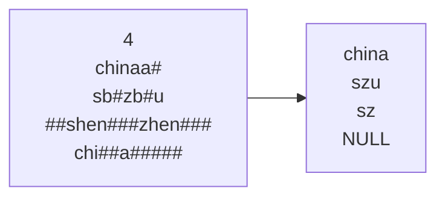
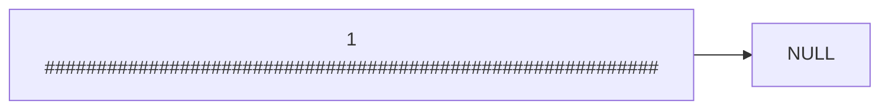

## 题目描述
使用C++的STL堆栈对象，编写程序实现行编辑功能。行编辑功能是：当输入#字符，则执行退格操作；如果无字符可退就不操作，不会报错
本程序默认不会显示#字符，所以连续输入多个#表示连续执行多次退格操作
每输入一行字符打回车则表示字符串结束
注意：必须使用堆栈实现，而且结果必须是正序输出

## 复盘盘点
栈的迭代也不要忘，是出栈  
实现栈的顺序输出，要么迭代，要么两个栈倒腾  

## 错误罗列
1. 栈无法用范围for，毕竟是栈  -->知识性错误
2. 栈的内容无法预览  -->知识性错误
3. 没入栈就输出!? -->可能是习惯性错误，应该不会再犯了吧
4. 输出后不迭代（不出栈），一直打印一个元素 -->习惯性错误，要养成循环迭代的习惯

## 样例


## 具体实现
```cpp
string str;
cin >> str;
int len = str.length();
stack<char> s;

//记录栈的长度
int s_len = 0;
for (int i = 0; i < len; i++)
{
	if(str[i]!='#')
	{
		s.push(str[i]);	
		s_len++;
	}
	else
	{
		if(!s.empty())
		{
			//出栈少一个元素
			s.pop();
			s_len--;
		}
	
	}
}

//把第一个栈的元素入第二个栈，这样可以正序
stack<char> s1;

//忘记入栈了，就这一部分全都没写就出栈
for (int i = 0; i < s_len; i++)
{
	s1.push(s.top());
	s.pop();
}

if (!s_len)
{
	cout << "NULL";
}
for (int i = 0; i < s_len; i++)
{
	cout << s1.top();
	//打印栈顶后也不出栈，就一直打印它
	s1.pop();
}
cout << endl;
```
