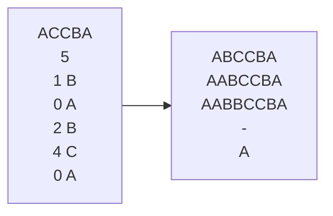
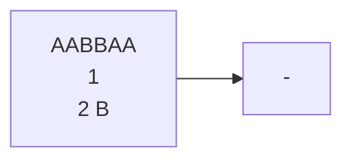

# 题目描述
祖玛是一款曾经风靡全球的游戏，其玩法是：在一条轨道上初始排列着若干个彩色珠子，其中任意三个相邻的珠子不会完全同色。此后，你可以发射珠子到轨道上并加入原有序列中。一旦有三个或更多同色的珠子变成相邻，它们就会立即消失。这类消除现象可能会连锁式发生，其间你将暂时不能发射珠子。
给定轨道上初始的珠子序列，然后是玩家所做的一系列操作。你的任务是，在各次操作之后及时计算出新的珠子序列。

# 输入
第一行是一个由大写字母'A'~'Z'组成的字符串，表示轨道上初始的珠子序列，不同的字母表示不同的颜色。

第二行是一个数字n，表示玩家共有n次操作。

接下来的n行依次对应于各次操作。每次操作由一个数字k和一个大写字母描述，以空格分隔。其中，大写字母为新珠子的颜色。若插入前共有m颗珠子，位置0-m-1，则k ∈ [0, m]表示新珠子嵌入在轨道上的位置。

# 样例

特殊的情况：


## 思考过程
1. 边界：过长或为0（过长因为链表而不考虑）
2. 所要的方法:  
   1. 插入（返回指针，指向插入元素）
   2. 判断是否三连（返回指针，指向要删除的最前面的元素）（**第二次及第三次改为是否三连以上**）
   3. 删除（返回指针，删除后相当于把后面的元素插入，所以返回删除的后一个的指针）
   4. 打印

  以上为初始想法  
3. 改进思考：
   边界不只是链表的长度，还有删除的条件，由于要操作指针，所以返回的指针是否为空，附近元素是否为空的判断都要有（第二次思考），
   最后拓展到用循环，只要有，只要满足相等的条件，我就移动指针（第三次思考）
   
## 错误罗列
1. 如果删除的元素后面没有东西了，我返回的指针该指向哪（NULL）（错在delete后未置空）
2. 在判断是否可消函数中，没判断元素是否存在，也就是删除后为空没判断，而且也没有判断是否是头指针，也就是边界考虑不全
3. 部分正确：未考虑四消（第二次），甚至更多消（第三次），思维固化，没接触过，现在知道了
4. 在判断是否可消函数中，写的是分别判断p的前后，p的前的前后的后（第一次，第二次都是），应该用循环判断（第三次）

## 代码分析具体

头结点数据为'\0'因为一开始可能会与他对比，但（第二次）之后就改变边界条件使得为头结点时不判断（更好）
```cpp
//初始化
void InitDList(Dlist& l)
{
	l = new DLnode;
	l->next = l->prior = NULL;
	l->data = '\0';
}
```
插入删除和双向链表基本一样
```cpp
//插入
bool InsertDL(Dlist& l,int i,char e, DLnode*& p)
{
	//仍选择遍历到插入的前一个位置
	int j = 0;
	while (p && j < i)
	{
		p=p->next;
		j++;
	}
	if (j > i || !p)
	{
		cout << "插入失败" << endl;
		return false;
	}

	DLnode* newLnode = new DLnode;
	newLnode->data = e;
	newLnode->next = p->next;
	if(p->next)
	{
		p->next->prior = newLnode;
	}
	newLnode->prior = p;
	p->next = newLnode;

	//最后让指针指向新插入的元素
	p = p->next;
	return true;
}

//删除
bool DeleteDL(Dlist& l, DLnode*& p)
{
	DLnode* r = p;
	if (!p)
	{
		cout << "删除位置不合法" << endl;
		return false;
	}
	p->prior->next = p->next;
	if (p->next)
	{
		p->next->prior = p->prior;

		//指向删除的下一个元素，这个元素相当于新插入的元素
		p = p->next;
		delete r;
		r = NULL;
	}
	else
	{
		delete p;
		p = NULL;
	}
	return true;
}
```

### 重点-判断是否可消函数

（第一次）：缺点：固定只能三消，判断条件过长，可读性极差  
原因：没想到使用循环判断，所以要判断所指元素的前后2个是否为空，是否相等，很麻烦  
```cpp
//插入位置在可消的中间
if (p&&p->next&&p->prior&&p->data == p->prior->data && p->data == p->next->data)
{
	Is = 1;
	p = p->prior;
}
//插入位置在可消的最后
else if (p&&p->prior&&p->prior->prior&&p->data == p->prior->data && p->data == p->prior->prior->data)
{
	Is = 1;
	p = p->prior->prior;
}
//插入位置在可消的最前面
else if (p&&p->next&&p->next->next&&p->data == p->next->data && p->data == p->next->next->data)
{
	Is = 1;
}
```

（第二次）：缺点：从三消改为了可以三到四消，未考虑初始很多连在一起的情况，  
优化：代码可读性提高，简洁了一些，指针随着判断移动，初步有了循环的思想  

```cpp
	if (r->next&&r->data == r->next->data)
	{
		Is++;
		if (r->next->next&&r->data == r->next->next->data)
		{
			Is++;
			
		}
	}

	
	if (r->prior!=l&&r->data == r->prior->data)
	{
		Is++;
		p = p->prior;
		if (r->prior->prior !=l&& r->data == r->prior->prior->data)
		{
			Is++;
			p = p->prior;
		}
	}
```

（第三次）：目前做到最好就这样，再优化可能再说吧  
优点：简洁，清晰，循环条件不复杂，指针更迭跟随循环，重复使用r同时作为迭代器与判断值是否相等的工具  

```cpp
//r作为迭代器，判断是否和新插入的值相等
DLnode* r = p;
while (r->next&&r->data==r->next->data)
{
	
	Is++;
	r = r->next;
}
r = p;
while (r->prior !=l&& r->data == r->prior->data)
{

	Is++;
	r = r->prior ;
	p = r;
}
```

测试中使用判断可消函数的部分分析：  
（第一次）：一层循环，如果可消，那就删除三次，（缺点：不可扩展，）  
（第二次，第三次）：加入计数器，删除计数个结点，（使用循环替换掉if判断的复杂）  
```cpp
while(1)
{
	int count = Isremove(l, p);

	for (int i = 0; i < count; i++)
	{
		DeleteDL(l, p);
	}
	if (!count)break;
}
```
## 复盘重点
1. 这次做的不错，重点在于先画图，先想明白如何实现再用电脑写
2. 读题要仔细，对（或，和）这类特殊字要敏感，（和就是条件都满足，或就是情况有多种）--> 习惯性错误
3. 指针释放后置空 --> 知识性错误
4. 多次做一个事情考虑使用循环，不要写成死代码 --> 习惯性错误


## 利用AI，我将这个小游戏做成了软件
下载地址: [蒟蒻做的祖玛](https://github.com/suzerize/Data-Structure-exercise/releases/download/v1.0/mysetup.exe)
