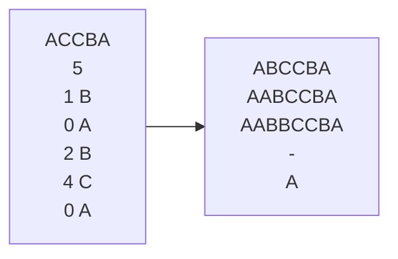

# 题目描述
祖玛是一款曾经风靡全球的游戏，其玩法是：在一条轨道上初始排列着若干个彩色珠子，其中任意三个相邻的珠子不会完全同色。此后，你可以发射珠子到轨道上并加入原有序列中。一旦有三个或更多同色的珠子变成相邻，它们就会立即消失。这类消除现象可能会连锁式发生，其间你将暂时不能发射珠子。
给定轨道上初始的珠子序列，然后是玩家所做的一系列操作。你的任务是，在各次操作之后及时计算出新的珠子序列。

# 输入
第一行是一个由大写字母'A'~'Z'组成的字符串，表示轨道上初始的珠子序列，不同的字母表示不同的颜色。

第二行是一个数字n，表示玩家共有n次操作。

接下来的n行依次对应于各次操作。每次操作由一个数字k和一个大写字母描述，以空格分隔。其中，大写字母为新珠子的颜色。若插入前共有m颗珠子，位置0-m-1，则k ∈ [0, m]表示新珠子嵌入在轨道上的位置。

# 样例

## 思考过程
1. 边界：过长或为0（过长因为链表而不考虑）
2. 所要的方法:  
   1. 插入（返回指针，指向插入元素）
   2. 判断是否三连（返回指针，指向要删除的最前面的元素）（**第二次及第三次改为是否三连以上**）
   3. 删除（返回指针，删除后相当于把后面的元素插入，所以返回删除的后一个的指针）
   4. 打印

  以上为初始想法  
3. 改进思考：
   边界不只是链表的长度，还有删除的条件，由于要操作指针，所以返回的指针是否为空，附近元素是否为空的判断都要有（第二次思考），
   最后拓展到用循环，只要有，只要满足相等的条件，我就移动指针（第三次思考）
   
## 错误罗列
1. 如果删除的元素后面没有东西了，我返回的指针该指向哪（NULL）（错在delete后未置空）
2. 在判断是否可消函数中，没判断元素是否存在，也就是删除后为空没判断，而且也没有判断是否是头指针，也就是边界考虑不全
3. 部分正确：未考虑四消（第二次），甚至更多消（第三次），思维固化，没接触过，现在知道了
4. 在判断是否可消函数中，写的是分别判断p的前后，p的前的前后的后（第一次，第二次都是），应该用循环判断（第三次）

## 复盘重点
1. 这次做的不错，重点在于先画图，先想明白如何实现再用电脑写
2. 读题要仔细，对（或，和）这类特殊字要敏感，（和就是条件都满足，或就是情况有多种）--> 习惯性错误
3. 指针释放后置空 --> 知识性错误
4. 多次做一个事情考虑使用循环，不要写成死代码 --> 习惯性错误

