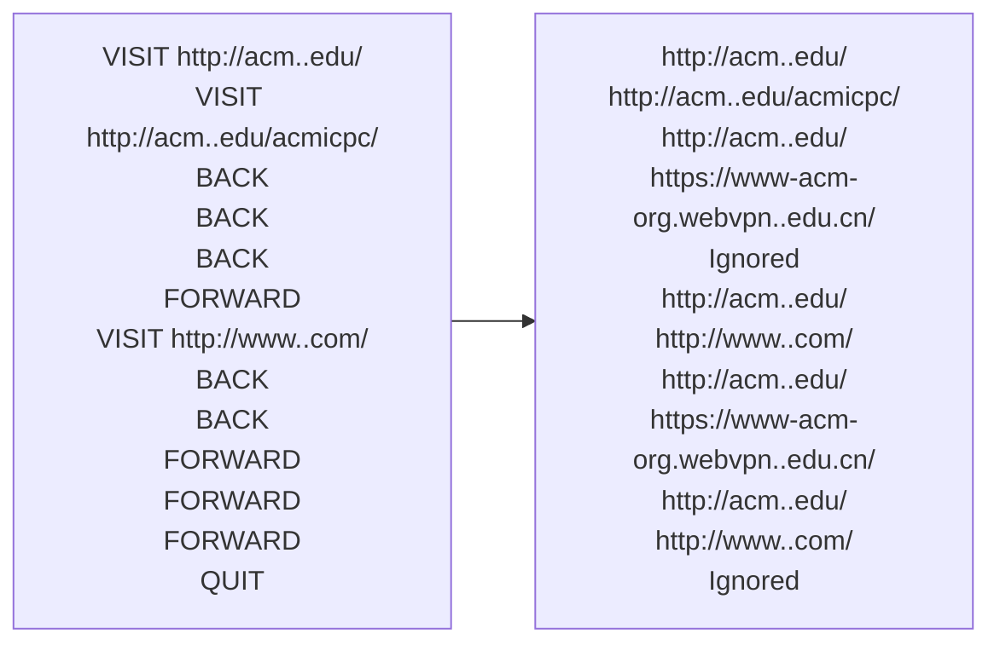

# 感想
我以为这道题挺简单，因为具体步骤他已经给我了，我只要照着做很快就完事了  
实则不然，他给我了步骤，正是因为这道题是难的，而他在第四道题这个位置，也说明他不简单  
需要优化做题的步骤，读题技巧

## 题目描述
标准Web浏览器包含在最近访问过的页面之间前后移动的功能。 实现这些功能的一种方法是使用两个堆栈来跟踪可以通过前后移动到达的页面。 在此问题中，系统会要求您实现此功能。  
需要支持以下命令：  
BACK：将当前页面推到前向堆栈的顶部。 从后向堆栈的顶部弹出页面，使其成为新的当前页面。 如果后向堆栈为空，则忽略该命令。  
FORWARD：将当前页面推到后向堆栈的顶部。 从前向堆栈的顶部弹出页面，使其成为新的当前页面。 如果前向堆栈为空，则忽略该命令。  
访问：将当前页面推送到后向堆栈的顶部，并将URL指定为新的当前页面。 清空前向堆栈。  
退出：退出浏览器。  
假设浏览器最初在URL https://www-acm-org.webvpn..edu.cn/上加载网页  

## 样例


## 复习盘点
1. 复习你的做题步骤
2. 不要着急而跳步

## 思考过程
（第一次）先画图理解题意，画了好几遍，理解一点，仍未与样例输出一致（这是伏笔）  
想着边写边就理解了，于是按照步骤描述写（将初始页推入后页栈，这是最大的错误，也是一开始就犯的错误）  
写完发现似乎是back与forward的问题（因为初始页错误入栈，导致若栈顶==now，那么要出栈两次），于是打补丁，发现一打打两个（另一个补丁是出栈两次意味着要判断两次是否为空），觉得不对，应该是别的问题  
这是才考虑到，很奇怪，一个页面最多出现在前页栈、后页栈、now中的一个，发现不该将初始页面入栈

## 错误罗列
1. 没理解题意，以为初始页要入栈，导致后面全部问题 -->习惯性错误  
**做题按步骤（无论简单与否），先读题，理解题意，考虑边界条件，然后画图，将过程展现，之后写伪代码，将思路符号化并检查是否有问题，最后没问题了再写代码，带注释**  
2. 输入（cin）字符串会以空格分隔 -->知识性错误  
3. 想要改变，传引用，不是他是模版类传个形参就能改变实参了 -->知识性错误
## 具体实现

最重要的两个函数：back与forward
```cpp
bool BACK(stack<string>&f, stack<string>&b, string &now)
{
	//if (b.top() == now)
	//{
	//	b.pop();
	//}

	//我要在后页栈不为空的条件下
	if(!b.empty())
	{
		//当前入前页
		f.push(now);
		//当前更新为后页的顶，也就是后一个（而不可能是同一个）
		now = b.top();
		//当前页需要出栈
		b.pop();

	}
	//否则thank you
	else
	{
		return false;
	}
	return true;
}
bool FORWARD(stack<string>&f, stack<string>&b, string &now)
{
	//if (f.top() == now)
	//{
	//	f.pop();
	//}
	//我要在前页栈不为空的条件下
	if(!f.empty())
	{
		//当前入后页
		b.push(now);
		//当前更新为前页的顶，也就是前页栈里的后一个（而不可能是同一个）
		now = f.top();
		//当前页需要出栈
		f.pop();
	}
	else
	{
		return false;
	}
	return true;
}
```
访问函数与停机函数，很简单，修改的时候顺手就改了，没卡我
```cpp
void VISIT(stack<string>& f, stack<string>& b, string& now, string& newone)
{
	//处理初始情况，访问第一个的时候不能入栈当前，当前什么也没有初始为空
	if (now != "")
	{
		b.push(now);
	}
	now = newone;
	//出栈前检查是否存在
	//清空栈
	while (!f.empty())
	{
		f.pop();
	}
}
void QUIT(stack<string>&f, stack<string>&b, string &now)
{
	while (!f.empty())
	{
		f.pop();
	}
	while (!b.empty())
	{
		b.pop();
	}
	now = "";
}
```
主函数逻辑，重点就是对于初始的操作
```cpp
stack<string> forS, backS;
string now = "";
string newone = "https://www-acm-org.webvpn..edu.cn/";
VISIT(forS, backS, now,newone);
string opera;
//发现输入string会按空格分开，很好了
//cout << opera;

//根据输入执行对应操作
while(cin >> opera&&opera!="QUIT")
{
	if (opera == "BACK")
	{
		if (BACK(forS, backS, now))
		{
			cout << now << endl;
		}
		else cout << "Ignored"<<endl;

	}
	else if (opera == "FORWARD")
	{
		if (FORWARD(forS, backS, now))
		{
			cout << now << endl;
		}
		else cout << "Ignored"<<endl;
	}
	else if (opera == "VISIT")
	{
		cin >> newone;
		VISIT(forS, backS, now,newone);
		cout << now << endl;
	}

}
QUIT(forS, backS, now);
```
