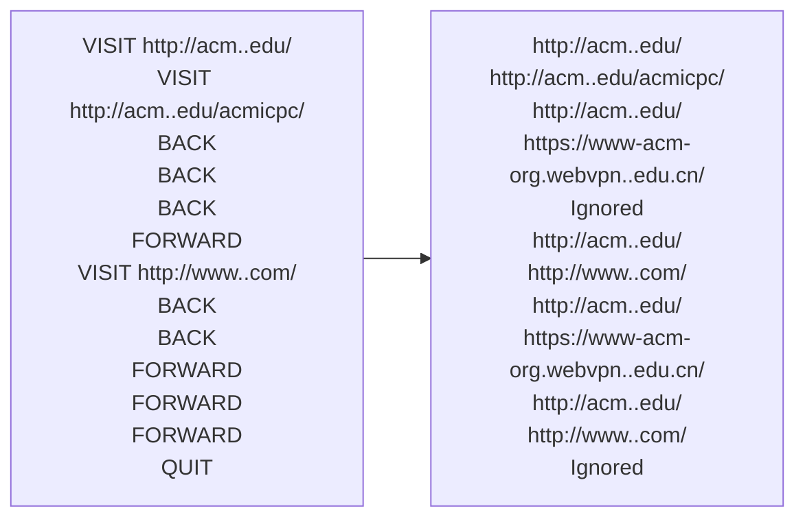

## 题目描述
标准Web浏览器包含在最近访问过的页面之间前后移动的功能。 实现这些功能的一种方法是使用两个堆栈来跟踪可以通过前后移动到达的页面。 在此问题中，系统会要求您实现此功能。  
需要支持以下命令：  
BACK：将当前页面推到前向堆栈的顶部。 从后向堆栈的顶部弹出页面，使其成为新的当前页面。 如果后向堆栈为空，则忽略该命令。  
FORWARD：将当前页面推到后向堆栈的顶部。 从前向堆栈的顶部弹出页面，使其成为新的当前页面。 如果前向堆栈为空，则忽略该命令。  
访问：将当前页面推送到后向堆栈的顶部，并将URL指定为新的当前页面。 清空前向堆栈。  
退出：退出浏览器。  
假设浏览器最初在URL https://www-acm-org.webvpn..edu.cn/上加载网页  

## 样例

## 复习盘点
1. 复习你的做题步骤
2. 不要着急而跳步

## 浪费时间
1. 画图着急，未理解题意 --> 慢点，理解透彻题意，全部  
2. 初始页推入后页栈 --> 导致后面问题，至少40分钟
3. back和forward出问题打补丁而不是检查数据状态 --> 20分钟瞎改
    
## 错误罗列
1. 没理解题意，以为初始页要入栈，导致后面全部问题 -->习惯性错误  
**做题按步骤（无论简单与否），先读题，理解题意，考虑边界条件，然后画图，将过程展现，之后写伪代码，将思路符号化并检查是否有问题，最后没问题了再写代码，带注释**  
2. 输入（cin）字符串会以空格分隔 -->知识性错误  
3. 想要改变，传引用，例外只有指针 -->知识性错误
