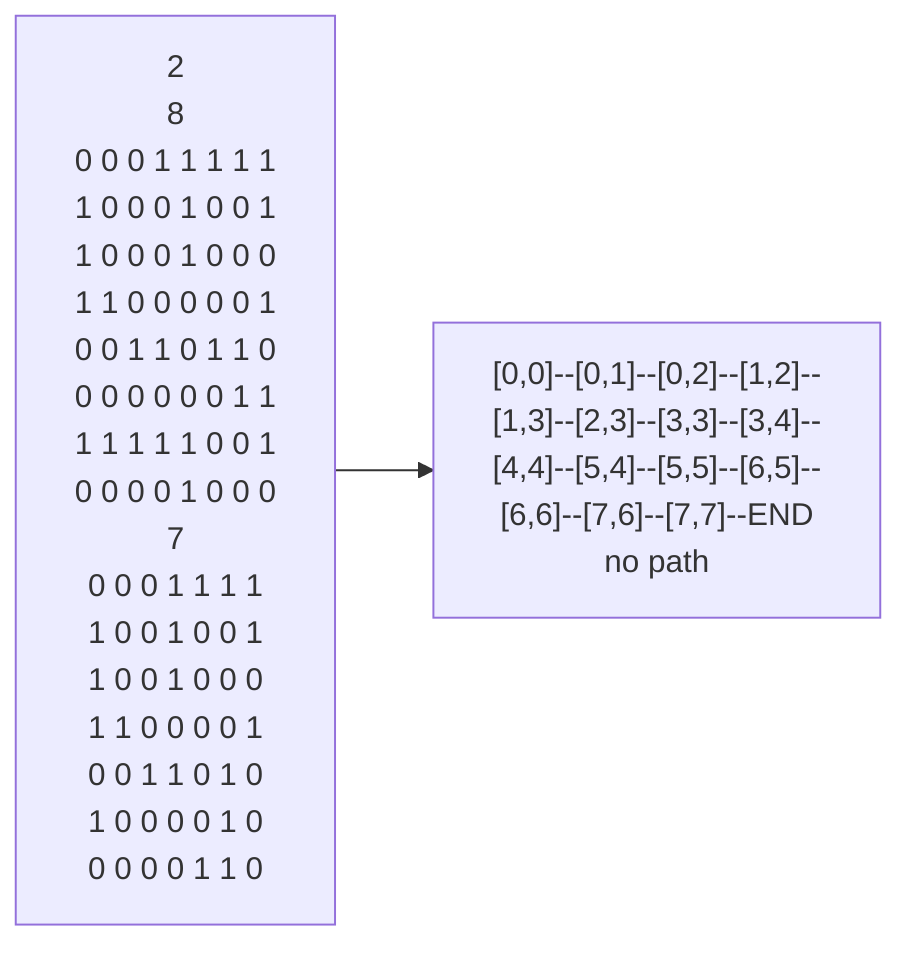

## 题目描述
给出一个N*N的迷宫矩阵示意图，从起点[0,0]出发，寻找路径到达终点[N-1, N-1]

要求使用堆栈对象来实现

## 测试案例

## 关键点
1. 每次判断一个结点，成功全部返回，失败恢复现场

## 递归模板
1. 明确函数功能，明确返回成功情况，对于一次运行，我要做的是什么
2. 有判断出去的标志，在开头判断，成功则出
3. 穷举所有可能，分别入栈等待验证
4. 对于所有可能，独立的判断，首先做出改变，进入递归，出递归后恢复现场（所有改变都要恢复）
5. 若需要找到的答案只是第一个，那递归后判真要退出，以不改变正确的结果

## 时间浪费
1. 复制代码时参数没全改，导致进不了递归，10''
2. 结果正确无法依次返回时打补丁而不是停下分析，30''
3. 用明知错误的while也不用if，导致后面全改一遍，20''
4. const常量引用没用，编译器的包容让我找不到错误原因，学艺不精，10''
## 错误归纳
1. 第一天留的时间不多，做的着急，没理清就写代码，出问题也只看代码没跳出来 -->尽量理清问题，做实现遇到问题纸笔分析 -->习惯性错误
2. 非常量引用临时变量 -->临时变量不可做左值，因此不可被非常量引用，但改常量引用可以 -->知识性错误
3. 没有恢复现场过程 -->递归最重要的是恢复现场，即将在该节点的改变都撤回（本题即出栈路线元素，改变做过的标记，还可能是sum累加，得减回去） -->知识性错误，习惯性错误
4. 现在与过去混为一谈，应设两个参数，更替，分开 --> 递归经常设计上一个影响下一个，用参数分清楚是写好代码和复习的关键-->习惯性错误
5. 判真返回有两个位置，纠结写在哪，答案是两者都写 -->该题只要一个答案若不及时返回会改变结果，若答案有多个且设计互不影响的则不需要返回 -->知识性错误
6. 因坐标改变不规律使用大量重复的if -->将特定顺序放入数组，这样就可以遍历了-->知识性错误
7. 永远在使用前确定其存在-->再次强调，我认为他一定存在的实际谁也说不准，故只要使用，不靠脑子，就写出来if(!s.empty)…… -->习惯性错误改进
8. 起点初始没标记已走过-->确定起点与终点特殊与否，明确在判断条件中是否能行 -->习惯性错误
